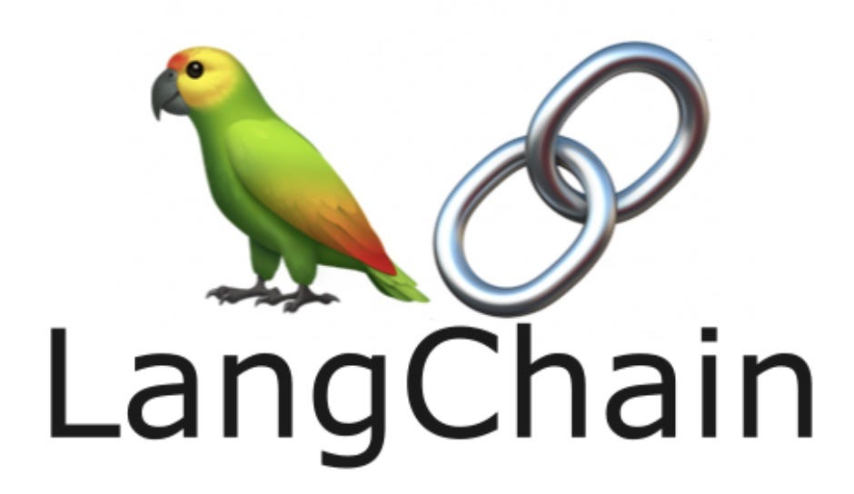

<h2 align="center">Hi, I'm Katya 👋</h2>

ML Engineer · AI Developer

## 👩‍💻 About Me

- 💼 ML/AI engineer with real-world experience in data engineering and analytics  
- 🛠 Building production-grade ML systems using PySpark, Azure, Docker & FastAPI  
- 🧪 Collaborating with a university research group at CZU on applied ML methods 
- 🧠 Strong foundation in math, statistics, and clean architecture design

## 🚀 Featured Projects

**[Pneumonia Classifier](https://github.com/caitlon/pneumonia-classifier)** – End-to-end FastAPI + Azure deployment for X-ray image classification  
**[NIRS – Tomato Spectroscopy Analysis](https://github.com/caitlon/NIRS)** – Deep regression pipeline for analyzing tomato quality with NIR spectroscopy, MLflow tracking, spectral transforms, and rich visualizations 

## 📈 GitHub Stats & Activity

  <!-- GitHub Stats -->
  <picture>
    <source media="(prefers-color-scheme: dark)" srcset="https://github-readme-stats.vercel.app/api?username=caitlon&hide_title=false&hide_rank=false&show_icons=true&include_all_commits=true&count_private=true&disable_animations=false&theme=dracula&locale=en&hide_border=false" />
    <source media="(prefers-color-scheme: light)" srcset="https://github-readme-stats.vercel.app/api?username=caitlon&hide_title=false&hide_rank=false&show_icons=true&include_all_commits=true&count_private=true&disable_animations=false&theme=default&locale=en&hide_border=false" />
    
  </picture>

  <!-- Streak Stats -->
  <picture>
    <source media="(prefers-color-scheme: dark)" srcset="https://streak-stats.demolab.com?user=caitlon&locale=en&mode=daily&theme=dracula&hide_border=false&border_radius=5" />
    <source media="(prefers-color-scheme: light)" srcset="https://streak-stats.demolab.com?user=caitlon&locale=en&mode=daily&theme=default&hide_border=false&border_radius=5" />
    
  </picture>

  <!-- Top Languages -->
  <picture>
    <source media="(prefers-color-scheme: dark)" srcset="https://github-readme-stats.vercel.app/api/top-langs?username=caitlon&locale=en&hide_title=false&layout=compact&card_width=320&langs_count=5&theme=dracula&hide_border=false" />
    <source media="(prefers-color-scheme: light)" srcset="https://github-readme-stats.vercel.app/api/top-langs?username=caitlon&locale=en&hide_title=false&layout=compact&card_width=320&langs_count=5&theme=default&hide_border=false" />
    
  </picture>

## 🛠️ Tech Stack

### Languages  

  
  
  
  
  

### ML & Data Science  

  
  
  
  
  
  
  
  

### Cloud & Infrastructure  

  
  
  
  

### Corporate Stack  

  
  
  

<!-- Snake -->
<picture>
  <source media="(prefers-color-scheme: dark)" srcset="https://raw.githubusercontent.com/caitlon/caitlon/output/github-snake-dark.svg" />
  <source media="(prefers-color-scheme: light)" srcset="https://raw.githubusercontent.com/caitlon/caitlon/output/github-snake.svg" />
  <!--  -->
  
</picture>
